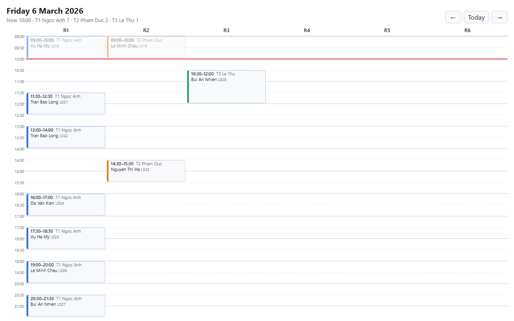

# Bright Path: conflict-safe schedule

One feature from the Bright Path brief: **book and cancel lessons without ever putting a student, a room or a tutor in two places at once**, and keep a record of every change so a tutor can see what changed after they were told. It is an ASP.NET Core Minimal API on PostgreSQL. The overlap rules are enforced by the database itself (exclusion constraints), and the centre's policy rules are checked in code.

- Why this feature, the data model and the rule split: [`DECISIONS.md`](DECISIONS.md).
- Why the write endpoints still open a transaction next to the exclusion constraints: [`TRANSACTIONS.md`](TRANSACTIONS.md).
- The plan, phase by phase: [`specs/roadmap.md`](specs/roadmap.md).
- **Today is pinned to Friday 2026-03-06 10:00 (+07:00)**, inside the exported week. Nothing reads the real clock.

## Prerequisites

- .NET 10 SDK.
- Node 20 or later. The solution includes the web project (`web/BrightPath.Web.esproj`), so `dotnet build` and `dotnet test` at the root also run `npm install` and `npm run build` in `web/`.
- PostgreSQL 13 or later on `localhost:5432`. The `btree_gist` extension ships with the standard installers.
- A database user that can `CREATE DATABASE` (the app creates `brightpath`, and each test run creates its own database) and `CREATE EXTENSION btree_gist` (a superuser, or the owner of the database).

## Connection string

The default is in `src/BrightPath.Api/appsettings.Development.json`:

```
Host=localhost;Port=5432;Database=brightpath;Username=postgres;Password=postgres
```

If yours is different, override it without editing the file, either with user-secrets or with an environment variable:

```bash
dotnet user-secrets set "ConnectionStrings:BrightPath" "Host=localhost;Port=5432;Database=brightpath;Username=me;Password=secret" --project src/BrightPath.Api
export ConnectionStrings__BrightPath="Host=localhost;Port=5432;Database=brightpath;Username=me;Password=secret"
```

The tests read the same setting and only change the database name.

## Run

```bash
dotnet run --project src/BrightPath.Api
```

- It listens on `http://localhost:5238`. The Scalar UI is at `http://localhost:5238/scalar/v1`, and the OpenAPI document is at `/openapi/v1.json`. Ready-made requests are in `src/BrightPath.Api/BrightPath.Api.http`.
- On first start, it creates the database, applies the migrations and loads the export from `src/BrightPath.Infrastructure/Seed/`. An early `fail` line about connecting to `brightpath` is expected: that is EF Core checking for the database before it creates it. The SQL is logged at `Information`, so the log is long.
- If the database already has data, it is not loaded again. To start over, run `DROP DATABASE brightpath WITH (FORCE);` in `psql`, then run the app again.
- To move the clock: `Clock__Now=2026-03-07T10:00:00+07:00 dotnet run --project src/BrightPath.Api`.

## Code layout

The backend is four projects. Each one depends only on the ones below it:

| Project | Holds |
|---|---|
| `src/BrightPath.Api` | Program.cs (wiring), the endpoints, and the mapping from a use case result to an HTTP response |
| `src/BrightPath.Infrastructure` | EF Core on Postgres: the DbContext, the migrations, the locks, the seed loader |
| `src/BrightPath.Application` | One handler per use case, and the small interfaces it reads and writes through |
| `src/BrightPath.Domain` | The entities and the centre rules. No package references |

The migrations live in Infrastructure, and the Api is the startup project:

```bash
dotnet ef migrations add <Name> --project src/BrightPath.Infrastructure --startup-project src/BrightPath.Api
```

## Test

```bash
dotnet test
```

The tests are in two projects. `tests/BrightPath.Api.UnitTests` needs no database, so it runs on its own with `dotnet test tests/BrightPath.Api.UnitTests`. `tests/BrightPath.Api.IntegrationTests` needs the same Postgres as the app. Each integration run creates one throwaway database `brightpath_test_<guid>` on the same server, migrates it, loads the export, and drops it at the end. Your `brightpath` database is never touched. The tests cover:

- every rule, as unit tests on the real export;
- the create use case with in-memory fakes (no database), and that the Domain and Application projects do not depend on EF Core, Npgsql or ASP.NET;
- each conflict, a valid exam pair and each cancel case, through HTTP;
- the races: two bookings for one room, two bookings for a tutor's last slot of the day, and two cancels of a pair. Each race test holds a transaction open, so it fails if its guard is removed;
- the pinned clock, and moving it.

## Web: the Today view

A read-only page with a room × time grid for one day: cancelled lessons struck through, past ones faded, a line at "now", `⚑` on rows the export flagged, a badge on lessons changed after the tutor was told, and `moved →` on a lesson that was moved, pointing to where it went. It needs the API running. In Visual Studio, `BrightPath.Web` is in the solution: F5 on it runs `npm run dev`, and its Vitest tests show in Test Explorer.

```bash
cd web
npm install
npm run dev     # http://localhost:5173, forwards /api to the API on :5238
npm test        # the grid layout
npm run lint    # oxlint, then type-aware ESLint (typescript-eslint)
```

The room grid is at `/rooms` (`/` goes there too). `←` and `→` move a day, `Today` goes back to the API's pinned today, and the date stays in the URL (`/rooms?date=2026-03-04`).

Each tutor in the header line (`T1 Ngoc Anh 7 · …`) links to **that tutor's day** (`/tutors/T1?date=2026-03-06`): their lessons as a list by time, whether the day is final yet (16:00 the day before), and a "Changed after you were told" box at the top. It reads `GET /api/tutors/{id}/day`. Back returns to the grid; moving the day does not add to the history. Old links (`/?tutor=T1&date=…`) still land on the right page.

**The rule breaks** are at `/violations`, linked from the end of the room grid's header line: every rule the schedule breaks, grouped by day, each with its rule, the API's message and the lessons involved. It reads `GET /api/reports/violations`. Two optional dates narrow the range, and they stay in the URL (`/violations?from=2026-03-05&to=2026-03-09`); changing them does not add to the history.



## Try it

Run these on a freshly loaded database. They use `curl` and [`jq`](https://jqlang.org/). Without `jq`, use the Scalar UI.

```bash
API=http://localhost:5238

# 1. Today: the busiest day of the export
curl -s "$API/api/sessions" | jq '{date, now, sessions: (.sessions | length), rooms: [.sessions | group_by(.roomId)[] | "\(.[0].roomId): \(length)"]}'

# The rooms and tutors are reference data, with endpoints of their own
curl -s "$API/api/rooms" | jq -c 'map(.id)'
curl -s "$API/api/tutors" | jq -c 'map("\(.id) \(.name)")'

# 2. The rules the export already broke
curl -s "$API/api/reports/violations" | jq '.violations[] | {rule, date, lessonIds, message}'

# 3. Student ids are made when the export is loaded, so read them from today's schedule
student() { curl -s "$API/api/sessions" | jq -r --arg n "$1" '[.sessions[].attendees[] | select(.studentName == $n)][0].studentId'; }
LONG=$(student "Tran Bao Long"); MY=$(student "Vu Ha My")

# 4. Refused: T3, R3 and Tran Bao Long are all busy with L028 at 10:00 tomorrow
curl -s -X POST "$API/api/sessions" -H 'Content-Type: application/json' \
  -d '{"tutorId":"T3","roomId":"R3","startsAt":"2026-03-07T10:00:00+07:00","durationMin":60,"studentIds":["'"$LONG"'"]}' | jq

# 5. Booked
curl -s -X POST "$API/api/sessions" -H 'Content-Type: application/json' \
  -d '{"tutorId":"T2","roomId":"R4","startsAt":"2026-03-07T13:00:00+07:00","durationMin":60,"studentIds":["'"$MY"'"]}' | jq '{id, tutorId, roomId, startsAt, endsAt, state, attendees: [.attendees[].studentName], changes}'

# 6. The family cancels L020 (today 10:30), 30 minutes before it starts
L020=$(curl -s "$API/api/sessions" | jq -r '.sessions[] | select(any(.attendees[]; .lessonId == "L020")) | "\(.id)/attendees/\(.attendees[0].id)"')
curl -s -X POST "$API/api/sessions/$L020/cancel" -H 'Content-Type: application/json' \
  -d '{"cancelledBy":"family"}' | jq '{startsAt, cancelled, attendees: [.attendees[] | {lessonId, status, cancelledBy, chargeable}], changes}'

# 7. T3's day: what changed after they were told
curl -s "$API/api/tutors/T3/day" | jq '{tutorName, date, cutoff, final, changesAfterCutoff: [.changesAfterCutoff[] | {kind, studentName, changedBy, changedAt}]}'
```

## What I saw

One run on an empty database, with the clock at the pinned default. The JSON is trimmed with `…` but not edited.

**Loading the export.** 34 CSV rows became 33 sessions and 34 attendees, because the exam pair L009 + L010 is one session with two attendees. The two cancelled rows became the two booking changes. The later row of each overlapping pair is flagged, so the constraints still load it.

```
Seeded 3 tutors, 6 students, 33 sessions, 34 attendees, 2 booking changes; legacy_violation on 1 session(s) and 1 attendee(s)
```

**1. Today.** Ten sessions. Seven of them are T1's, all in R1.

```json
{ "date": "2026-03-06", "now": "2026-03-06T10:00:00+07:00", "sessions": 10,
  "rooms": ["R1: 7", "R2: 2", "R3: 1"] }
```

**2. The export breaks the rules four times.** It is loaded as history and flagged, not fixed or dropped.

```json
{ "rule": "student-overlap", "date": "2026-03-04", "lessonIds": ["L007", "L008"], "message": "Le Minh Chau is in R3 with T3 and in R2 with T2 at 09:00." }
{ "rule": "tutor-load",      "date": "2026-03-06", "lessonIds": ["L018", "L021", "L022", "L024", "L025", "L026", "L027"], "message": "T1 Ngoc Anh has 7 sessions on 2026-03-06; the limit is 6." }
{ "rule": "closed-day",      "date": "2026-03-09", "lessonIds": ["L032"], "message": "Vu Ha My in R3 with T3 at 10:00 on Monday 2026-03-09; the centre is closed on Mondays." }
{ "rule": "tutor-overlap",   "date": "2026-03-10", "lessonIds": ["L033", "L034"], "message": "T1 Ngoc Anh is in R1 and R2 at 09:00." }
```

**4. Refused.** Every conflict comes back at once, in plain words, and each one names the lesson in the way.

```json
{
  "title": "The booking breaks centre rules",
  "status": 409,
  "detail": "3 conflicts.",
  "conflicts": [
    { "rule": "room-overlap",    "date": "2026-03-07", "sessionIds": ["…", "…"], "lessonIds": ["L028"], "message": "R3 holds two sessions at once: T3 at 09:00 and T3 at 10:00." },
    { "rule": "tutor-overlap",   "date": "2026-03-07", "sessionIds": ["…", "…"], "lessonIds": ["L028"], "message": "T3 Le Thu has two sessions in R3, at 09:00 and 10:00." },
    { "rule": "student-overlap", "date": "2026-03-07", "sessionIds": ["…", "…"], "lessonIds": ["L028"], "message": "Tran Bao Long is in R3 with T3 at 09:00 and in R3 with T3 at 10:00." }
  ],
  …
}
```

**5. Booked.** A new booking leaves a change record too. It is not after the cut-off, because tomorrow's schedule only becomes final at 16:00 today.

```json
{ "id": "…", "tutorId": "T2", "roomId": "R4",
  "startsAt": "2026-03-07T13:00:00+07:00", "endsAt": "2026-03-07T14:00:00+07:00", "state": "upcoming",
  "attendees": ["Vu Ha My"],
  "changes": [ { "kind": "created", "attendeeId": null, "changedAt": "2026-03-06T10:00:00+07:00", "changedBy": "centre", "afterCutoff": false, "note": null } ] }
```

**6. A late family cancel.** It is chargeable (less than 4 hours before the start) and flagged as after the cut-off. L020 was its session's only student, so the session is cancelled too, with a change of its own, and its room and tutor are free again.

```json
{ "startsAt": "2026-03-06T10:30:00+07:00", "cancelled": true,
  "attendees": [ { "lessonId": "L020", "status": "cancelled", "cancelledBy": "family", "chargeable": true } ],
  "changes": [
    { "kind": "cancelled", "attendeeId": "…",  "changedAt": "2026-03-06T10:00:00+07:00", "changedBy": "family", "afterCutoff": true, "note": null },
    { "kind": "cancelled", "attendeeId": null, "changedAt": "2026-03-06T10:00:00+07:00", "changedBy": "family", "afterCutoff": true, "note": null } ] }
```

**Tests.** All green, on their own database.

```
Passed!  - Failed:     0, Passed:   108, Skipped:     0, Total:   108, Duration: 585 ms - BrightPath.Api.UnitTests.dll (net10.0)
Passed!  - Failed:     0, Passed:    29, Skipped:     0, Total:    29, Duration: 2 s - BrightPath.Api.IntegrationTests.dll (net10.0)
```

## Troubleshooting

- **`password authentication failed`**: set your connection string (see [Connection string](#connection-string)).
- **`permission denied to create extension "btree_gist"`**: use a superuser, or make your user the owner of the database.
- **A killed test run left a database behind.** List them with `SELECT datname FROM pg_database WHERE datname LIKE 'brightpath_test_%';`, then drop each one with `DROP DATABASE "<name>" WITH (FORCE);`.

## Where to read next

- [`DECISIONS.md`](DECISIONS.md): questions for the owner, contradictions in the brief and the data, the feature picked and what it leaves broken, and the design.
- [`specs/roadmap.md`](specs/roadmap.md): the phases, in order. Each phase has its requirements, plan and validation in `specs/<date>-<phase>/`.
- The commit history: one commit per phase, each saying what changed and why.
